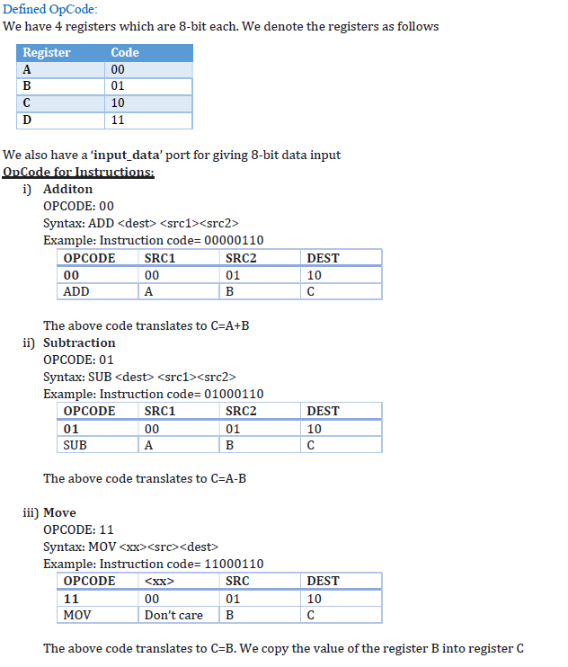
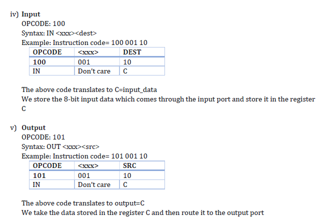
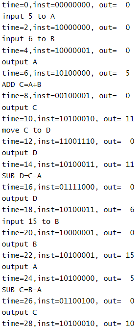
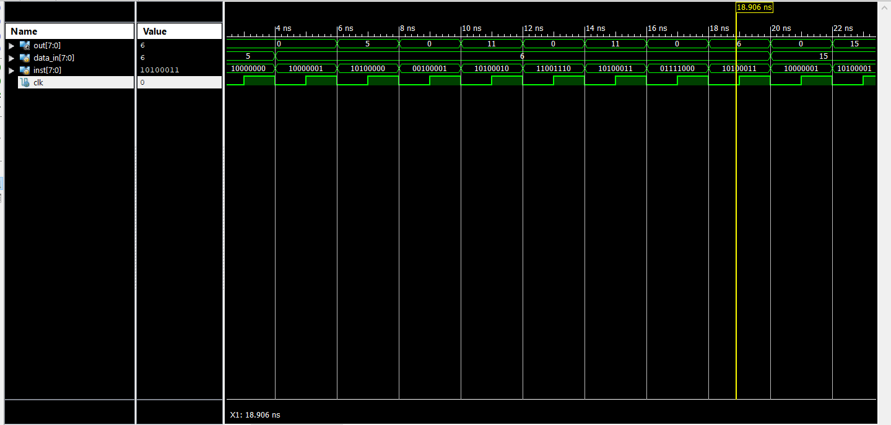
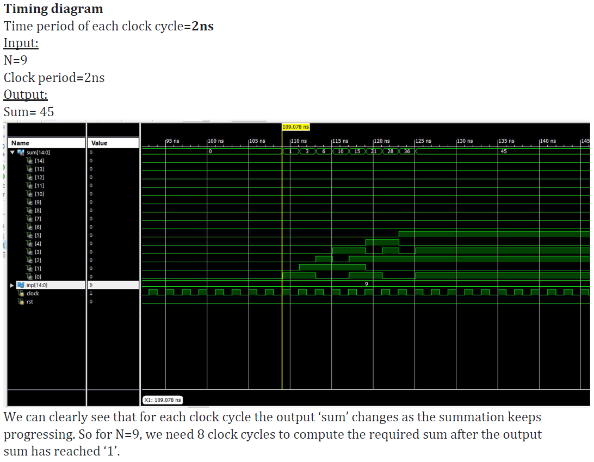

# Verilog Digital Electronics Project

#### Project 1: Processor

Designed a 8-bit processor to perform:Addition,Subtraction,Shift,Input,Fetchoperations on 4 registers with Verilog Structural modelling

#### Project 2: Adder of first N natural numbers

Designed an Adder to find the sum of the first N Natural Numbers using Verilog. Implemented the design on a FPGA resource in ISE suite

**Folder structure:**

- Natural_Numb_Adder: Contains Verilog code for the 1 to N Adder
- Processor: Contains Verilog code for the 8-bit Processor
- Report.PDF : Contains detailed report of the two projects and its results

**Software used in this project:** Xilinx ISE Design Suite

## How to run the Application?

1. Download and install Xilinx ISE Design Suite or Vivado from the official website. Or we can use online compiler: https://www.edaplayground.com/
2. Go into the project folder
3. Copy the contents of 'Code.txt' into a verilog module.
4. Copy the contents of 'Testbench.txt' into the verilog module as the testbench for the previously defined module

**NOTE :**

- For the 1 to N Natural number adder the 'N' can be set in the testbench code
- For the Processor , the entered sequence of OpCode can be set in the testbench code

## Project 1 : Processor

### OpCode for Instructions to the Processor:

  

### Screenshot for the Output of Processor

  

  

## Project 2 : 1 to N Adder

